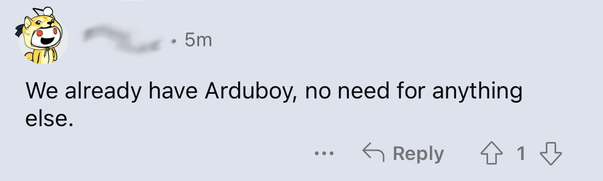
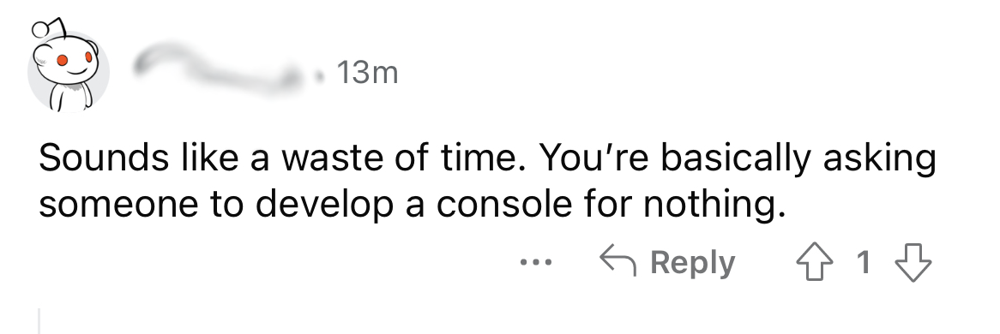
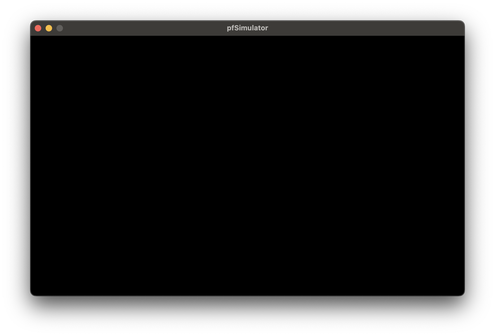

I'll' try my best to do weekly updates. I know how these things go, but I'm going to try. Updates may not be at the beginning of the week all the time though.

I needed to know if someone else was attempting to write a fantasy core on the **Pocket**. So I decided to [ask the internet](https://www.reddit.com/r/AnaloguePocket/comments/10csl4g/anyone_working_on_a_custom_open_source_console/) and I think I may have gotten more than I bargained for:

    
    

I think the main takeaway ideasx are:

1. I definitely needs to do this 😂.
1. No one else seems to be doing this.

First, of course, I needed to order a [**Pocket**](https://www.analogue.co/pocket). Those things are in short supplies so, just like the **Playdate**, you end up on a waiting list of some sort. I'm currenly in group **C (182XXX)** which is slated for, hopefully, sometime this year. Given that they just shipped **129xxx** I've got a while to go. In the **Playdate**'s case I ended up getting one on eBay so I don't know how patient I'm going to be this time around.

Second, I needed to define some basic guidelines for what **Project Freesdom**'s goals are:

- I want to be open-source and **GPL-v3** to be precise. I don't necessarily want to write everything from scratch so if there are good projects that are compatible license-wise then I should build on top of those.
- I probably don't want to design a whole **CPU** in **FPGA**, so using an existing one would be best.
- I do want to try and design a **GPU** for it but I've never done **FPGA** before, so shooting to implement for an old school **2D** sprite and tilemap system is probably lofty enough.
- I want an SDK to support development in **assembly** and **C**. **Lua** may come later if the **CPU** can handle it.
- I want the SDK to be written in **C** or **Python**. The firmware will be written in **C**. Any custom tools in the toolchain will be written in **Python**.

That last part may be controvertial. I've dabbled in so many other languages over the years and when the **Playdate** came out the first thing we saw was people asking if they could use **C++**, **Rust**, etc... It's just personal preference for me. I want this to be simple and fun. I find **C++** to be just a bloated mess that produces bloated code (if you don't know what you're doing) and  feel the syntax has become a joke over the years too. **Rust** may be cool but I also don't like the syntax which seems antiquated to me.

I've been doing some **C** again when I got into **Playdate** development and it's super refreshing to get back to a simple, small language even with all its downsides compared to some modern languages.

**Python** is the perfect language as far as I'm concerned. Small. Simple. Powerful. Cross Platform. It's perfect for tools.

So given all that, and since there is so much to do, where do we start?

It's really daunting to start developing each parts separately in the hope that someday they will connect and everything will work. So instead, I'm going to use the tracing bullet technique. The goal is to connect both ends of the problem, on one side user-code written for the console and on the other the screen where the graphics are displayed, right off the bat so that you have something working right away. You can then build on this, keeping everything working at all times.

Furthermore, since I don't have a **Pocket** in hand and I know nothing about **FPGA** right now, I decided to start off by writing a **Simulator** for the console. This will give me something to write the **SDK** on, test some designs (written in code) for the **GPU** and will eventually be useful for developing on the console anyway. I think it needs to be eventually multi-platform but I really want to shield mysekf from get into cross-platform development as much as possible so I decided to base it on [**libSDL**](https://www.libsdl.org). It's in **C**. It's **GPL** compatible and it will pretty much cover everything I need: graphics, sound and controllers. Bonus is, it wil be easy to build the simulator for other **Apple** devices like **iPhone**, **iPad** or **Apple TV** which could be fun.

I chose to develop that part of the project using **Xcode** instead of some custom **IDE** combined with **Make** or **CMake**. I miss working on a pure **XCode** project and I don't want to spend too much time emulating what **Xcode** does with my own envirorment. I've done that before for things like notarizing apps and it's not fun. You end up fighting against the platform instead of working with it. Other platform will just have their own projects that will be maintained in parallel. Not a huge deal.

So in no time at all, I got this up and running:

It's just a simple **XCode** project, launching **SDL** which opens a window. Nothing fancy but there you have my tracing bullet. This is all the framework I need to start building on, addding the two side: One that runs code written for the console and the other runs the code simulating the console and its various parts.

If you want to follow along, the repo for **pfSimulator** can be found [here](https://github.com/ProjectFreedomGaming/pfSimulator).

With ❤️ from Paris, France.
